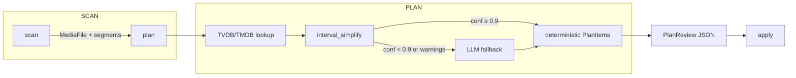

# NameGnome Serve

[](https://github.com/DouglasMacKrell/namegnome-serve/actions/workflows/ci.yml)
[](https://www.python.org/downloads/)
[](https://github.com/astral-sh/ruff)

**Local-first media file renaming service powered by LangChain, LangServe, and Ollama.**

NameGnome Serve provides deterministic media planning backed by provider metadata
(TMDB, TVDB, MusicBrainz) with optional LLM assistance for fuzzy or anthology-heavy
libraries. The project is currently mid-sprint with a published roadmap and a
deterministic-first implementation of the Scan → Plan → Apply pipeline.

---

## 🎯 Highlights

- **Deterministic-first pipeline** – Provider APIs (TVDB/TMDB/MusicBrainz) are the
  primary source of truth. The LLM only runs for unresolved or ambiguous cases.
- **Scan → Plan → Apply** – Three-phase workflow with plan previews, warnings, and
  rollback tokens for filesystem changes.
- **Anthology intelligence** – Filenames are parsed into `segments`; the
  `interval_simplify` detangler resolves overlaps/gaps before the LLM is consulted.
- **Local LLM** – Ollama hosts the LangChain runnable; no cloud dependency.
- **SQLite cache** – Versioned migrations initialise/upgrade `~/.cache/namegnome.db`
  with `entities`, `episodes`, `tracks`, `decisions`, and `cache_entries`.
- **Tooling & automation** – Cursor MCP integration, FastAPI/LangServe endpoints,
  Ruff + mypy in CI, and ≥80% coverage gate.

---

## 🧭 Table of Contents

1. [Quick Start](#-quick-start)
2. [Pipeline Overview](#-pipeline-overview)
3. [CLI Commands](#-cli-commands)
4. [Configuration](#-configuration)
5. [Development](#-development)
6. [Testing](#-testing)
7. [Documentation](#-documentation)
8. [Contributing](#-contributing)
9. [License & Credits](#-license--credits)

---

## 🚀 Quick Start

### Prerequisites

- Python ≥ 3.12
- [Poetry](https://python-poetry.org/docs/#installation)
- [Ollama](https://ollama.ai/) with the `llama3:8b` model
- Provider API keys (TMDB, TVDB). Optional keys unlock OMDb, FanartTV, AniDB, etc.

### Installation

```bash
# Clone and install
git clone https://github.com/DouglasMacKrell/namegnome-serve.git
cd namegnome-serve
poetry install

# Configure environment
cp env.example .env
# Edit .env with provider keys and optional overrides

# Build the local Ollama model
ollama create namegnome -f models/namegnome/Modelfile

# Launch the FastAPI server (LangServe endpoints)
poetry run uvicorn namegnome_serve.app:app --reload
```

---

## 🔄 Pipeline Overview



1. **Scan** builds `MediaFile` models that include parsed metadata and anthology
   `segments` derived from filenames.
2. **Plan** runs deterministic provider lookups and the anthology interval
   simplifier. High-confidence spans return immediately; unresolved spans are passed
   to the LangChain/Ollama runnable.
3. **Apply** (Sprint 4) executes rename operations with rollback manifests and locks.

The Scan → Plan → Apply stages are callable individually so you can integrate them
into automation, MCP workflows, or CI.

---

## 🖥️ CLI Commands

Typer CLIs live under `namegnome_serve.cli`. Invoke them via Poetry:

```bash
# Plan a directory and emit PlanReview JSON
poetry run python -m namegnome_serve.cli.plan generate \
  --root /Volumes/Media/TV \
  --media-type tv \
  --json

# Plan with pretty output and summary
poetry run python -m namegnome_serve.cli.plan generate \
  --root /Volumes/Media/Movies \
  --media-type movie \
  --verbose

# Apply cache migrations (idempotent)
poetry run python -m namegnome_serve.cli.cache \
  --db-path ~/.cache/namegnome.db
```

> Want shorter commands? Add console scripts to `pyproject.toml` (e.g.,
> `namegnome-plan = "namegnome_serve.cli.plan:app"`).

---

## ⚙️ Configuration

- **Environment variables** – Defined in `env.example`. Required: `TMDB_API_KEY`,
  `TVDB_API_KEY`. Optional: `OMDB_API_KEY`, `FANARTTV_API_KEY`, `ANIDB_API_KEY`,
  `NAMEGNOME_DEBUG`, etc.
- **Cache location** – Defaults to `~/.cache/namegnome.db`. Override via
  `NAMEGNOME_CACHE_PATH`. Run the cache CLI when changing the path or migrating
  between versions.
- **Anthology segments** – Scanner populates `MediaFile.segments` with start/end,
  tokenised titles, and source metadata. Deterministic interval simplification
  (T3-06) uses these segments and provider adjacency rules before the LLM is invoked.
- **Ollama configuration** – `models/namegnome/Modelfile` is the canonical prompt.
  Re-run `ollama create` after tweaking temperature, system prompt, or context.

---

## 🛠️ Development

### Project Structure

```
namegnome-serve/
├── src/namegnome_serve/
│   ├── core/                # Scanner, deterministic mappers, anthology helpers
│   ├── metadata/providers/  # Provider clients with retry/backoff
│   ├── cache/               # SQLite schema & migrations
│   ├── chains/              # LangChain builders for fuzzy mapping
│   ├── routes/              # Pydantic schemas + LangServe wiring
│   ├── cli/                 # Typer apps (plan/cache)
│   └── mcp/                 # Cursor MCP definitions
└── tests/                   # Unit + integration tests
```

### Coding Standards

- Python ≥ 3.12 with `__future__.annotations`.
- Ruff handles formatting (`ruff format`) and linting (`ruff check`).
- mypy runs in `--strict`; prefer `typing_extensions` features where needed.
- Maintain ≥ 80% coverage. Anthology utilities and deterministic mappers are
  extensively unit-tested.
- Keep domain boundaries clear (scanner → mapper → LLM → plan/apply).
- Use absolute imports rooted at `namegnome_serve`.

### Helpful Commands

```bash
# Run a focused module
poetry run pytest tests/core/test_interval_simplifier.py

# Full suite with coverage
poetry run pytest --cov=namegnome_serve --cov-report=term-missing

# Formatting, linting, and type checks
poetry run ruff format .
poetry run ruff check .
poetry run mypy .
```

---

## 🧪 Testing

```bash
# Run all tests (default command in CI)
poetry run pytest

# Generate HTML coverage report
poetry run pytest --cov=namegnome_serve --cov-report=html
open htmlcov/index.html

# Run fuzzier LangChain integration tests only
poetry run pytest tests/chains --maxfail=1
```

---

## 📖 Documentation

- **[PLAN.md](./PLAN.md)** – Architecture decisions, API surface, caching strategy,
  and sprint roadmap.
- **[MEDIA_CONVENTIONS.md](./MEDIA_CONVENTIONS.md)** – Naming guidance, anthology
  parsing expectations, and deterministic interval rules.
- **[DESIGN_CLARIFICATIONS.md](./DESIGN_CLARIFICATIONS.md)** – FAQ-style decisions
  around disambiguation, cache choices, MCP expectations, etc.
- **[TASKS_SPRINTS_1-4.md](./TASKS_SPRINTS_1-4.md)** & **[TASKS_SPRINTS_5-8.md](./TASKS_SPRINTS_5-8.md)** –
  Sprint breakdown with acceptance criteria.

---

## 🤝 Contributing

1. Follow the coding standards above and keep coverage ≥ 80%.
2. Document new modules or behaviour in the relevant markdown documents.
3. Use commit messages like `NGS-XYZ: concise description`.
4. Run `poetry run pytest` and `poetry run mypy .` before raising a PR.

Issues and feature requests are welcome! See `CONTRIBUTING.md` for more detail.

---

## 📄 License & Credits

- License: MIT (pending finalisation).
- Built with love for home media libraries.
- Thanks to [LangChain](https://github.com/langchain-ai/langchain),
  [Ollama](https://ollama.ai/), and metadata providers
  ([TMDB](https://www.themoviedb.org/), [TVDB](https://thetvdb.com/),
  [MusicBrainz](https://musicbrainz.org/)).

---

**Reliable media planning with deterministic backbone and LLM finesse.**
